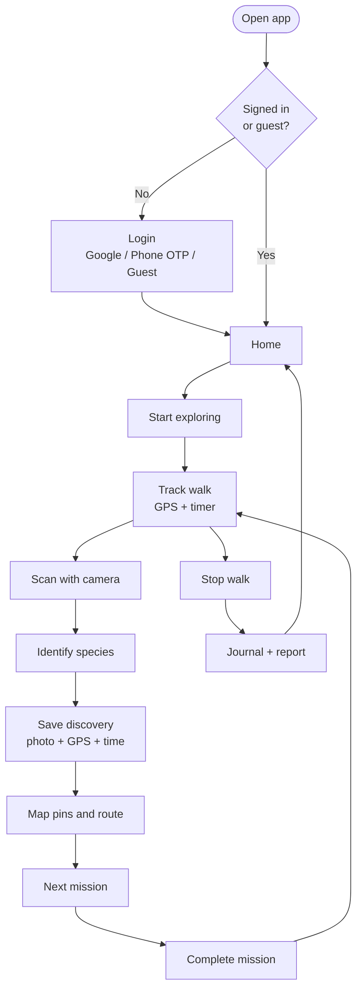
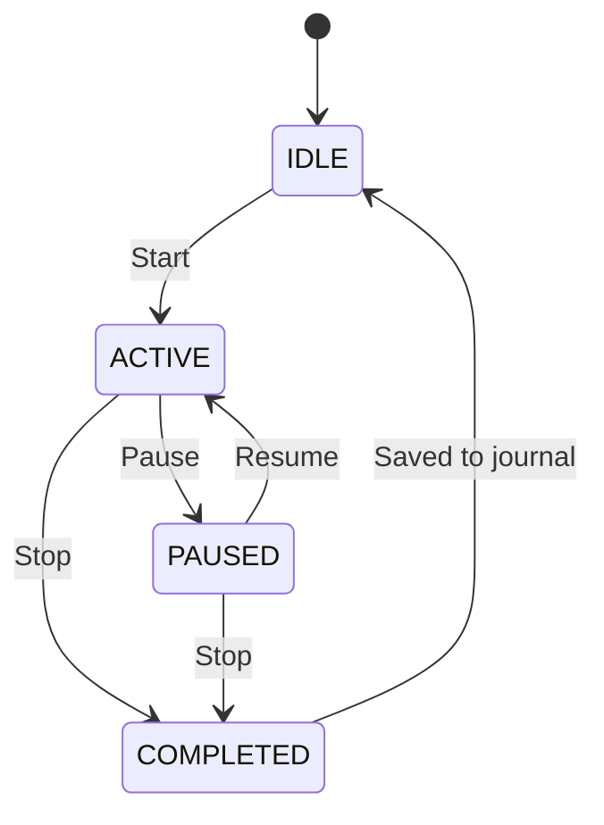
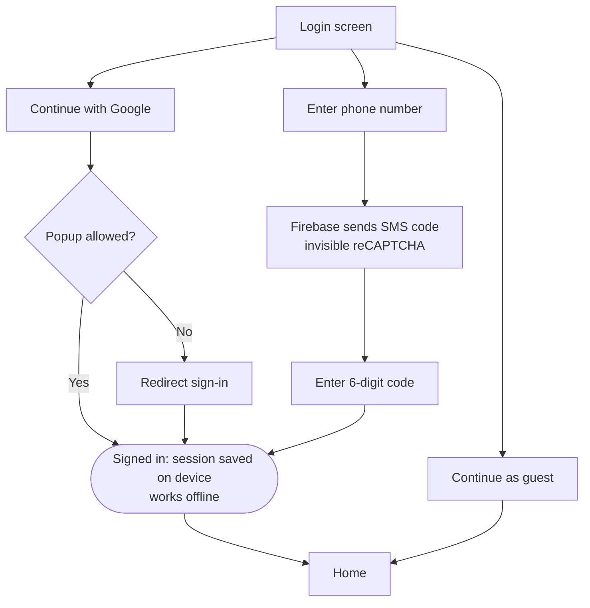
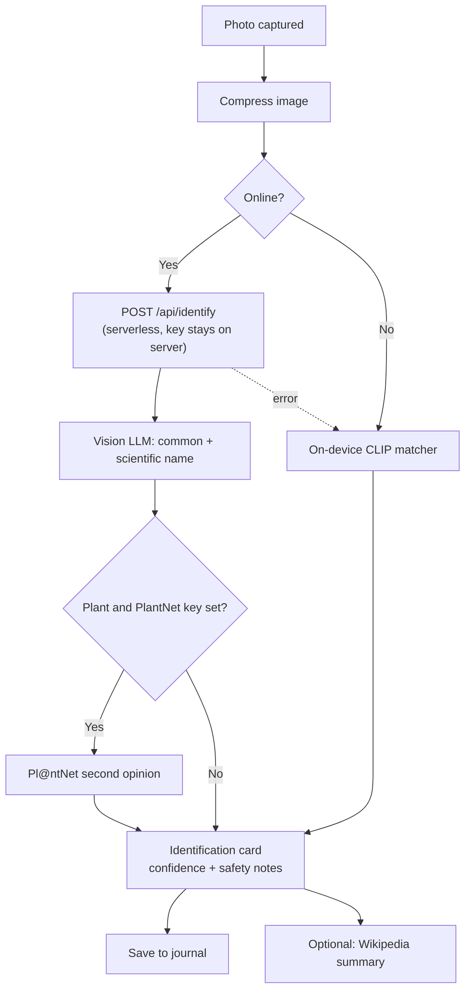

# 🌿 NatureLens AI

**A mobile-first outdoor companion.** Go for a walk, scan the plants, birds and insects you meet, and watch your journal, map and stats fill up. It's a PWA that installs on your phone and works offline.


---

## Table of contents

1. [Features](#features)
2. [App flow](#app-flow)
3. [Screens](#screens)
4. [How it works](#how-it-works)
5. [Tech stack](#tech-stack)
6. [Project structure](#project-structure)
7. [Getting started](#getting-started)
8. [Environment variables](#environment-variables)
9. [Sign-in setup (Google + phone)](#sign-in-setup-google--phone)
10. [Scripts](#scripts)
11. [Testing](#testing)
12. [Deploying](#deploying)
13. [Troubleshooting](#troubleshooting)
14. [Roadmap](#roadmap)
15. [Credits and data sources](#credits-and-data-sources)

---

## Features

- **Sign in with Google or your phone number** (SMS code), or continue as a guest.
- **Home dashboard**: nearest nature spot, Today / Week / All time stats, weekly goal ring with streak, daily mission and recent finds.
- **Walk tracking**: GPS route, distance (Haversine with outlier filtering), active time and estimated calories. Steps show "unavailable" rather than being faked.
- **Scan and identify**: take a photo of a plant, bird or insect. A cloud vision model names it, with an on-device fallback when you're offline.
- **Map**: nearby parks and reserves from OpenStreetMap, walking routes, live distance-to-go and a Google Maps hand-off.
- **Journal**: every walk has a detail view with route map, discoveries (with photos), missions and a saved report.
- **Missions**: small rule-based challenges ("listen for a bird for 10 seconds"), optionally reworded by an LLM, with voice read-out and voice commands.
- **XP and explorer level** from discoveries and completed missions.
- **Offline-first**: all your data lives in IndexedDB on the device.

---

## App flow

### Main user journey



### Walk session state machine



### Sign-in flow



### Species identification flow



---

## Screens

| Tab | Route | What it does |
| --- | --- | --- |
| Login | (shown before the app) | Google, phone OTP or guest |
| Home | `/` | Nearby spot, stats, goal ring, mission, recent finds, account menu |
| Explore | `/explore` | Start, pause and stop a walk; live distance and time |
| Scan | `/scanner` | Camera or upload, identification, more info |
| Map | `/map` | Nearby spots, route to a destination, discovery pins |
| Journal | `/journal` | Past walks, discoveries, reports |

---

## How it works

**Data.** Everything is stored locally in IndexedDB through [Dexie](https://dexie.org/). The UI reads it live and never touches IndexedDB directly.

| Table | Holds |
| --- | --- |
| `explorationSessions` | start/end time, distance, calories, active minutes, route points |
| `discoveries` | species name, category, confidence, photo, GPS, timestamp, method |
| `missions` | type, text, status, reward, timestamps |
| `userProfile` | weight, total XP, streak, settings |

**Missions.** A deterministic rule engine picks the next mission type from your context (time of day, distance, what you've found). An LLM may only *reword* it. If no proxy is configured, you're offline, or the call fails, the built-in template text is used. The LLM never invents a species.

**Stats.** `src/features/stats` is pure, unit-tested logic: weeks start on Monday, "new species" means the first-ever sighting falls in the period, and a streak counts consecutive days with a walk or a find (an empty *today* doesn't break it yet).

**Privacy.** Photos go to your own serverless function so the API key never reaches the browser. Location is only requested when needed. Walks and finds stay on the device.

---

## Tech stack

| Area | Choice |
| --- | --- |
| UI | React 18, TypeScript, React Router |
| Build | Vite 5, `vite-plugin-pwa` (service worker, installable) |
| Storage | Dexie (IndexedDB), `dexie-react-hooks` |
| Auth | Firebase Authentication (Google + phone) |
| Maps | Leaflet, react-leaflet, OpenStreetMap, Overpass API, OSM routing |
| Vision | Vision LLM via `/api/identify`, Pl@ntNet (optional), Transformers.js CLIP (offline) |
| Info | Wikipedia summaries (no key) |
| Tests | Vitest |

---

## Project structure

```
naturelens/
├── api/                       # Serverless function (Vercel) + shared identify logic
│   ├── identify.ts            #   POST /api/identify
│   └── _identify.ts           #   LLM + Pl@ntNet merge, runs server-side only
├── public/                    # PWA icons
├── src/
│   ├── App.tsx                # Auth gate, routes, bottom navigation
│   ├── components/            # NearbyHero, GoalRing, BarChart, RecentFinds, AccountMenu, Icons
│   ├── db/database.ts         # Dexie schema + CRUD helpers
│   ├── features/
│   │   ├── activity/          # Walk session state machine, GPS tracking
│   │   ├── auth/              # Firebase init + AuthProvider
│   │   ├── camera/            # Capture + image compression
│   │   ├── journal/           # Session reports
│   │   ├── location/          # Geolocation helpers
│   │   ├── missions/          # Rule engine, context, wording
│   │   ├── places/            # Nearby spots (Overpass) + useNearby hook
│   │   ├── stats/             # Today / week / all-time stats, streaks
│   │   ├── vision/            # classify (offline), identify (cloud), info (Wikipedia)
│   │   └── voice/             # Speech output + voice commands
│   ├── pages/                 # Dashboard, Explore, Scanner, MapPage, Journal, Login
│   └── utils/                 # format + geo helpers
├── .env.example
├── .npmrc
├── vite.config.ts             # Also serves /api/identify in dev
└── package.json
```

---

## Getting started

**Requirements:** Node.js 18.18 or newer (20 or 22 recommended).

```bash
git clone https://github.com/<your-username>/naturelens.git
cd naturelens
npm install
cp .env.example .env      # on Windows: copy .env.example .env
npm run dev
```

Then open the URL Vite prints (usually `http://localhost:5173`).

> **Camera and GPS need HTTPS or `localhost`.** To try it on a phone, use a deployed build (Vercel/Netlify) or an HTTPS tunnel.

Without any keys the app still runs: sign-in is disabled (use *Continue as guest*) and scans fall back to the on-device matcher.

---

## Environment variables

Copy `.env.example` to `.env`. Never commit `.env`.

| Variable | Required | Purpose |
| --- | --- | --- |
| `ANTHROPIC_API_KEY` | For cloud scans | Server-side only. Never prefix with `VITE_`. |
| `ANTHROPIC_MODEL` | No | Override the default vision model |
| `PLANTNET_API_KEY` | No | Better plant accuracy ([free key](https://my.plantnet.org)) |
| `VITE_FIREBASE_API_KEY` | For sign-in | Firebase web config (public by design) |
| `VITE_FIREBASE_AUTH_DOMAIN` | For sign-in | e.g. `your-project.firebaseapp.com` |
| `VITE_FIREBASE_PROJECT_ID` | For sign-in | Firebase project id |
| `VITE_FIREBASE_APP_ID` | For sign-in | Firebase web app id |
| `VITE_LLM_ENDPOINT` | No | Your own proxy used to reword missions |

---

## Sign-in setup (Google + phone)

1. Go to the [Firebase console](https://console.firebase.google.com), create a project, then **Authentication → Sign-in method** and enable **Google** and **Phone**.
2. **Authentication → Settings → Authorized domains**: make sure `localhost` and your deployed domain are listed.
3. **Project settings → Your apps**: add a Web app and copy the four config values into `.env`.
4. While developing, add **test phone numbers** (Authentication → Sign-in method → Phone) so you don't send real SMS. Check Firebase's current SMS quota and pricing before launch.

Signed-in sessions are stored on the device and keep working offline. Walks and finds are stored per device, not per account.

---

## Scripts

| Command | What it does |
| --- | --- |
| `npm run dev` | Dev server with the `/api/identify` middleware |
| `npm run build` | Type-check, then production build |
| `npm run preview` | Serve the production build locally |
| `npm test` | Run unit tests |

---

## Testing

```bash
npm test
```

Covered: mission rules, geo math, places parsing, journal report, identification parsing and stats (week bars, new species, streaks).

**Manual checklist (needs a real device):**

- [ ] Camera or GPS permission denied
- [ ] Airplane mode: app shell and saved data work; first AI scan needs a network to fetch the model
- [ ] Refresh mid-walk and after saving
- [ ] Five different scans
- [ ] Google and SMS sign-in on the deployed domain

---

## Deploying

**Vercel (recommended):**

1. Push the repo to GitHub and import it in Vercel.
2. Add the environment variables above under *Project → Settings → Environment Variables*.
3. Deploy. `api/identify.ts` runs as a serverless function and the PWA is served over HTTPS.
4. Add the Vercel domain to Firebase **Authorized domains**.

Netlify or any static host works for the front end, but you'll need to port `api/identify.ts` to that host's functions.

---

## Troubleshooting

**`npm install` fails.** `.npmrc` sets `ignore-scripts=true` because `sharp` and `onnxruntime-node` (pulled in by Transformers.js) download native binaries that often fail on Windows or restricted networks, and the browser app doesn't use them. If it still fails: delete `node_modules` and `package-lock.json`, run `npm cache verify`, then `npm install`. Use `npm install`, not `npm ci`, after adding dependencies.

**Sign-in says "isn't set up yet".** The `VITE_FIREBASE_*` values are missing. Restart `npm run dev` after editing `.env`.

**`auth/unauthorized-domain`.** Add your domain under Firebase → Authentication → Settings → Authorized domains.

**Scans always use the offline matcher.** `ANTHROPIC_API_KEY` is missing, you're offline, or the request failed.

**Map spots don't load.** Nearby spots and routes use free public OpenStreetMap services and need a connection. The last result is cached for 30 minutes.

---

## Roadmap

- [ ] Bird sound identification (BirdNET)
- [ ] Per-account data (separate local data for each signed-in user)
- [ ] Restore an in-progress walk after a reload
- [ ] Editable weekly goal
- [ ] Optional cloud sync

---

## Credits and data sources

- Map data © [OpenStreetMap](https://www.openstreetmap.org/copyright) contributors, via Overpass and routing.openstreetmap.de. These are public fair-use servers: self-host or use a paid router for production.
- Plant identification support by [Pl@ntNet](https://plantnet.org) (check their quota and attribution terms, and credit them if you enable it).
- Species summaries from Wikipedia.
- Built with React, Vite, Dexie, Leaflet, Firebase and Transformers.js.

## License

Add a `LICENSE` file before publishing (MIT is a common choice for open-source projects).
